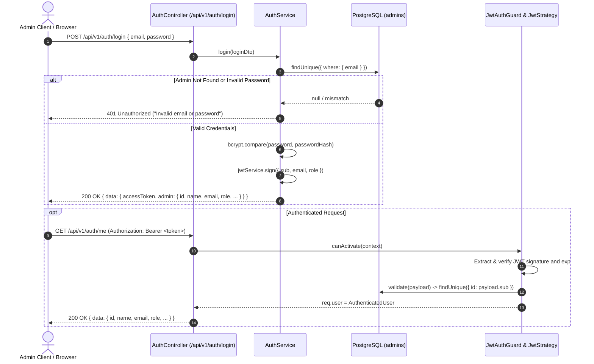

# Authentication & Security Architecture

> **Implementation Phase:** Phase 3 — Common API Foundation + Authentication  
> **Auth Strategy:** Passport JWT (`passport-jwt`) with bcrypt password hashing (10 salt rounds) and global NestJS guards.

---

## 1. Authentication Flow



---

## 2. JWT Payload & Claims

The issued JWT access token contains the minimal necessary claims to verify identity and role without leaking sensitive data:

```json
{
  "sub": "b3f5818f-afb9-4ffb-a626-e1ce3548f7d7",
  "email": "admin@miles.io",
  "role": "SUPER_ADMIN",
  "iat": 1791218000,
  "exp": 1791304400
}
```

- **`sub`**: Subject identifier corresponding to the Admin UUID in PostgreSQL.
- **`email`**: Admin user email address.
- **`role`**: Administrator role (`SUPER_ADMIN` | `ADMIN`).
- **Forbidden Claims:** Passwords, password hashes, secrets, internal database connection strings, or personal identity documents are **never** placed into the JWT payload.

---

## 3. Token Expiry & Refresh Strategy

- **Token Expiration:** Configured via `JWT_EXPIRES_IN` in `.env` (defaults to `1d` — 24 hours).
- **Enforcement:** `ignoreExpiration: false` is set in `JwtStrategy`. When an expired token is submitted, Passport rejects the request immediately, and `JwtAuthGuard` translates the error to HTTP `401 Unauthorized` (`"Token has expired"`).
- **Revocation Safety:** When `JwtStrategy.validate(payload)` executes, it verifies that the `Admin` record still exists in the PostgreSQL database. If an administrator is deleted, all tokens issued for that admin are invalidated instantly.

---

## 4. Route Protection Architecture

- **Global Guard Enforcement:** `JwtAuthGuard` is registered globally as an `APP_GUARD` in `AppModule`.
- **Default Deny:** Every route across the API is protected by default. A request without a valid Bearer token cannot reach any feature controller method.
- **Extraction:** Tokens must be provided in the HTTP `Authorization` header with the `Bearer` scheme:
  ```http
  Authorization: Bearer <accessToken>
  ```
- **Controller Access to User:** The `@CurrentUser()` parameter decorator extracts the validated `AuthenticatedUser` object (`id`, `email`, `name`, `role`) attached to `request.user`.

---

## 5. Public Routes Bypass

Routes that require public access are decorated with `@Public()`:

```typescript
import { Public } from '../common/decorators/public.decorator.js';

@Public()
@Get('health')
getHealth() { ... }
```

### Whitelisted Public Routes
1. `GET /health` and `GET /api/v1/health`: Cloud infrastructure health probes.
2. `POST /api/v1/auth/login`: Administrator login endpoint.
3. `GET /api/docs*`: Swagger UI documentation and OpenAPI specification assets.

---

## 6. Password Hashing Policy

- **Algorithm:** bcrypt with 10 salt rounds (`saltRounds = 10`).
- **Validation:** Passwords are never stored in plaintext or reversible encryption.
- **Transformation Boundary:**
  - `Admin` entity in Prisma includes `passwordHash`.
  - Service layer never returns `passwordHash`.
  - `AdminProfileDto` deliberately omits `passwordHash`.
  - E2E tests assert that `JSON.stringify(response.body)` contains zero occurrences of `passwordHash`.

---

## 7. Rate Limiting Policy

Rate limiting is enforced globally via `@nestjs/throttler` (registered as an `APP_GUARD` executed prior to authentication):

- **Global Throttle:** `THROTTLE_LIMIT=100` requests per `THROTTLE_TTL=60` seconds window per client IP.
- **Stricter Login Throttle:** `@Throttle({ default: { limit: 5, ttl: 60000 } })` applied to `POST /api/v1/auth/login`. Limits repeated brute-force authentication attempts to a maximum of 5 requests per 60 seconds.
- **Throttling Response:** When a client exceeds the limit, the API returns HTTP `429 Too Many Requests`:
  ```json
  {
    "statusCode": 429,
    "message": "Too Many Requests",
    "error": "Too Many Requests",
    "timestamp": "2026-10-05T16:52:09.904Z",
    "path": "/api/v1/auth/login"
  }
  ```

---

## 8. Security Considerations & Hardening

1. **Helmet HTTP Headers:** Active via `helmet()` in `main.ts`, applying `X-DNS-Prefetch-Control`, `X-Frame-Options: SAMEORIGIN`, `Strict-Transport-Security`, `X-Download-Options`, `X-Content-Type-Options: nosniff`, and `X-Permitted-Cross-Domain-Policies`.
2. **CORS Restrictions:** Origin whitelist parsed from `FRONTEND_URL`. In production, wildcard `*` is prohibited.
3. **Strict ValidationPipe:**
   - `whitelist: true`: Strips unspecified properties.
   - `forbidNonWhitelisted: true`: Immediately rejects payloads with unmapped fields (protecting against parameter tampering).
   - `transform: true`: Enforces type conversions via `class-transformer`.
4. **Exception Masking:** Unhandled exceptions (HTTP 500) log details and stack traces server-side while returning generic safe payloads to clients. SQL errors and database credentials are never exposed.
