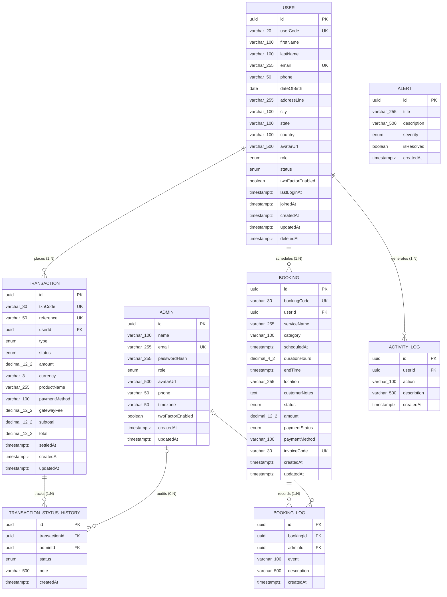

# Entity Relationship Diagram (ERD) - Implemented Schema

This diagram visualizes the implemented PostgreSQL schema for Miles Admin Hub API in Mermaid ER notation.

---

## Implemented Relationship & Key Summary

| Parent Entity | Relationship | Child Entity | Cardinality | Foreign Key | Delete Rule | Meaning & Audit Invariant |
|---|---|---|---|---|---|---|
| `User` | places | `Transaction` | `1 : N` | `Transaction.userId` | `RESTRICT` | Financial records are never removed even when customer account is soft-deleted. |
| `Transaction` | tracks | `TransactionStatusHistory` | `1 : N` | `TransactionStatusHistory.transactionId` | `CASCADE` | Transaction maintains an immutable chronological processing history log. |
| `Admin` | audits | `TransactionStatusHistory` | `0 : N` | `TransactionStatusHistory.adminId` | `SET NULL` | Records optional acting administrator who authorized/settled the transaction. |
| `User` | schedules | `Booking` | `1 : N` | `Booking.userId` | `RESTRICT` | User appointments across all service categories. |
| `Booking` | records | `BookingLog` | `1 : N` | `BookingLog.bookingId` | `CASCADE` | Booking lifecycle progression events. |
| `Admin` | audits | `BookingLog` | `0 : N` | `BookingLog.adminId` | `SET NULL` | Records optional acting administrator who rescheduled/cancelled the booking. |
| `User` | generates | `ActivityLog` | `1 : N` | `ActivityLog.userId` | `CASCADE` | User-centric security and profile update audit log feed. |
| *(None)* | standalone | `Alert` | `N/A` | `N/A` | `N/A` | Operational dashboard system alerts. |
| *(None)* | standalone | `Admin` | `N/A` | `N/A` | `N/A` | Authenticated operators managing the dashboard platform. |

---

## Database Sequences

| Sequence Name | Target Format | Concurrency Invariant |
|---|---|---|
| `user_code_seq` | `USR-0001` | Atomic PostgreSQL sequence allocation (`SELECT nextval('user_code_seq')`) |
| `txn_code_seq` | `TXN-0001` | Atomic PostgreSQL sequence allocation (`SELECT nextval('txn_code_seq')`) |
| `booking_code_seq` | `BKG-0001` | Atomic PostgreSQL sequence allocation (`SELECT nextval('booking_code_seq')`) |
| `invoice_code_seq` | `INV-10001` | Atomic PostgreSQL sequence allocation (`SELECT nextval('invoice_code_seq')`) |
