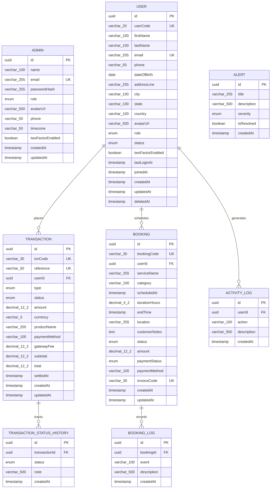

# Entity Relationship Diagram (ERD)

This document visualizes the complete database schema for Miles Admin Hub API using Mermaid ER notation.

---

## Relationship Summary

| Parent Entity | Relationship | Child Entity | Cardinality | Foreign Key | Cascade Rule | Business Meaning |
|---|---|---|---|---|---|---|
| `User` | places | `Transaction` | `1 : N` | `Transaction.userId` | `ON DELETE RESTRICT` | A user can execute many transactions. Financial records are preserved even if user is suspended. |
| `Transaction` | tracks | `TransactionStatusHistory` | `1 : N` | `TransactionStatusHistory.transactionId` | `ON DELETE CASCADE` | Each transaction has a sequential timeline of status transitions and processing notes. |
| `User` | schedules | `Booking` | `1 : N` | `Booking.userId` | `ON DELETE RESTRICT` | A user can reserve many bookings and appointments across various service categories. |
| `Booking` | records | `BookingLog` | `1 : N` | `BookingLog.bookingId` | `ON DELETE CASCADE` | Each booking logs lifecycle events (Creation, Assignment, Confirmation, Rescheduling). |
| `User` | generates | `ActivityLog` | `1 : N` | `ActivityLog.userId` | `ON DELETE CASCADE` | Users accumulate security and account update audit entries displayed on their detail page. |
| *(None)* | standalone | `Admin` | Independent | N/A | N/A | Administrators authenticate and manage the platform via JWT tokens. |
| *(None)* | standalone | `Alert` | Independent | N/A | N/A | System alerts are triggered globally by system health conditions and pending queues. |
